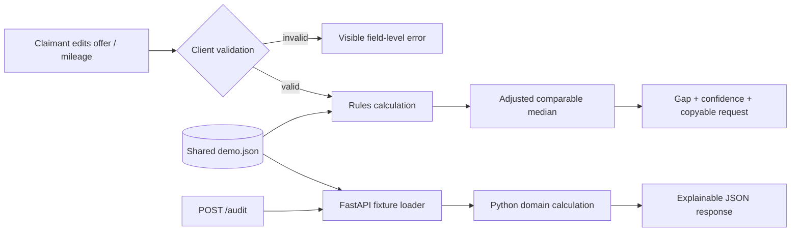
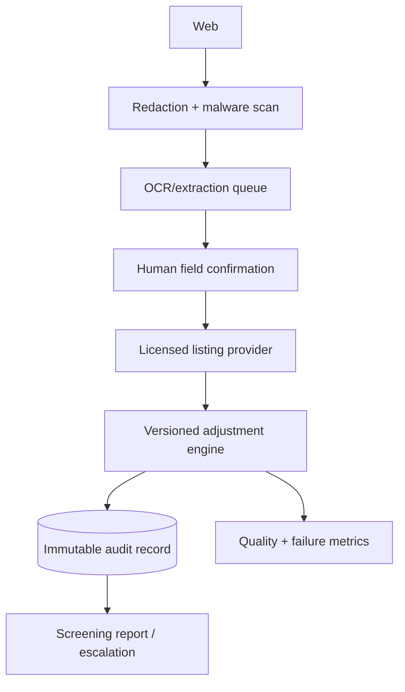

# Architecture

## Demo flow



The deployed static frontend does not call the API. This is intentional: Pages cannot host FastAPI, and the workflow does not provision billable hosting. Frontend and API share fixture semantics; Python integration tests prove the server implementation independently.

## API contract

`POST /audit`

```json
{
  "insurer_offer": 25400,
  "mileage": 54800,
  "excluded_ids": ["PP-104"]
}
```

Returns adjusted comparables, median market value, offer gap, percentage, confidence, next step, and disclaimer. Pydantic rejects malformed/range-invalid data with `422`. Unknown comparable IDs and fewer than two included comps return named `422` errors. Missing or malformed fixtures return `503 demo fixture unavailable`.

## Production boundary



Every production audit must pin its evidence timestamp and rule version. Extraction, evidence retrieval, and report generation require explicit pending/failed states and idempotency keys.
